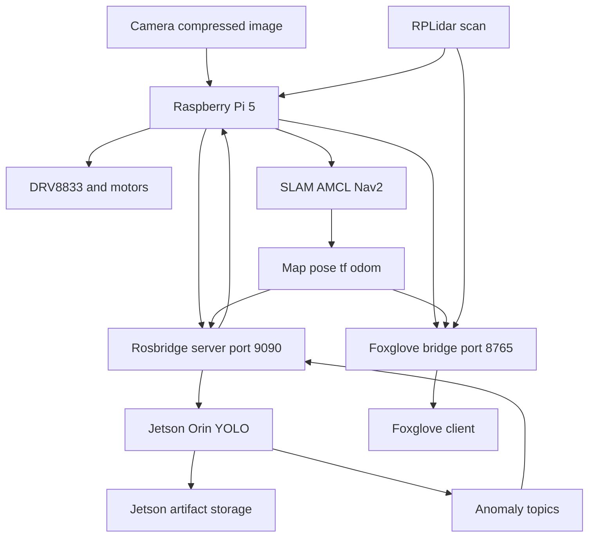

# Pregled arhitekture sustava

Ovaj dokument opisuje aktualnu arhitekturu diplomskog robota: Raspberry Pi 5 upravlja robotom i ROS 2 sustavom, Jetson Orin izvodi YOLO detekciju anomalija, a Foxglove prikazuje navigacijske i anomaly podatke kroz Raspberry Pi.

## Sažetak aktualnog stanja

```text
Raspberry Pi 5
├─ glavno ROS 2 računalo robota
├─ motorni bridge: rpi_direct GPIO -> DRV8833
├─ LiDAR, kamera, SLAM, lokalizacija i Nav2
├─ rosbridge_server za razmjenu odabranih topic-a s Jetsonom
└─ foxglove_bridge za vizualizaciju

Jetson Orin
├─ vanjsko AI računalo
├─ rosbridge WebSocket klijent prema Raspberry Pi računalu
├─ YOLO detekcija anomalija
├─ prva anomaly klasa: bottle
├─ lokalno spremanje originalne slike, anotirane slike, slike mape i JSONL događaja
└─ objava anomaly topic-a za Foxglove prikaz

Foxglove
└─ WebSocket veza prema Raspberry Pi foxglove_bridge servisu
```

Aktualna komunikacijska granica između Jetsona i Raspberry Pi računala je `rosbridge` WebSocket. Jetson prima samo odabrane podatke potrebne za YOLO inference i lokalizaciju anomalije, a Raspberry Pi održava ROS 2 robot stack, mapu, lokalizaciju, navigaciju i Foxglove vezu.

## Vizualizacija arhitekture sustava



## Trenutni hardverski put

Aktivni motorno-upravljački put je:

```text
Raspberry Pi 5 -> GPIO -> DRV8833 -> motori
```

Trenutne konfiguracijske vrijednosti:

- `BRIDGE_MODE=rpi_direct`
- `GPIOCHIP=/dev/gpiochip4`
- `DRIVER=drv8833`
- `ENCODERS_ENABLED=0`
- motor driver: DRV8833
- motor command interface: Raspberry Pi GPIO kroz `bridge_cont`
- izvori poze robota: LiDAR, SLAM, AMCL/Nav2 i dostupni ROS pose topic-i

Detaljno fizičko ožičenje i popis GPIO pinova nalazi se u [CURRENT_WIRING_DIAGRAM.md](./CURRENT_WIRING_DIAGRAM.md).

## ROS 2 runtime komponente

| Komponenta | Uloga |
| --- | --- |
| `bridge_cont` | Raspberry Pi GPIO motor bridge za DRV8833, konfiguriran s `ENCODERS_ENABLED=0` |
| `laser_driver_cont` | RPLidar A1 driver i objava `/scan` topic-a |
| `slam_cont` | SLAM Toolbox, izrada karte i spremanje mape |
| `nav_cont` | Nav2, AMCL, goal forwarding, cmd_vel mux i safety logika |
| `realsense_cont` | RealSense/kamera RGB, depth, camera_info i IMU topic-i |
| `sensor_fusion_cont` | IMU filtriranje i robot_localization prema potrebi sustava |
| `rosbridge_cont` | WebSocket most na portu `9090` za Jetson i odabrane klijente |
| `foxglove_bridge_cont` | WebSocket most na portu `8765` za Foxglove vizualizaciju |
| `jetson_yolo_client` | Jetson aplikacija za YOLO detekciju anomalija preko rosbridge veze |

## Jetson anomaly pipeline

Aktivni anomaly pipeline izvodi se na Jetson Orin računalu:

```text
/camera/.../compressed + /map + /robot_pose_map ili /amcl_pose
    -> rosbridge_server na Raspberry Pi računalu
    -> Jetson YOLO anomaly client
    -> lokalno spremanje artefakata na Jetsonu
    -> anomaly visualization topic-i
    -> rosbridge_server na Raspberry Pi računalu
    -> foxglove_bridge
    -> Foxglove prikaz
```

Prvi realni scenarij koristi `bottle` kao anomaly klasu. Jetson objavljuje:

- `/anomaly/events` (`std_msgs/String`, JSON)
- `/anomaly/markers` (`visualization_msgs/MarkerArray`)
- `/anomaly/debug_image/compressed` (`sensor_msgs/CompressedImage`)
- `/anomaly/map_snapshot/compressed` (`sensor_msgs/CompressedImage`)

Marker na mapi koristi tekst `ANOMALY: bottle` i TTL od 180 sekundi.

## Spremanje artefakata na Jetsonu

Jetson lokalno sprema sve artefakte detekcije:

```text
/home/jetson/anomaly_logs/
├── images/
│   ├── original/
│   └── annotated/
├── map_images/
└── events.jsonl
```

Za svaki detektirani objekt klase `bottle` Jetson sprema:

- originalnu sliku kamere
- anotiranu sliku s YOLO bounding boxom
- sliku mape s oznakom `ANOMALY: bottle`
- JSONL zapis događaja s klasom, confidence vrijednosti, bounding boxom, pozicijom robota i procijenjenom pozicijom anomalije

## Foxglove vizualizacija

Foxglove se spaja na Raspberry Pi:

```text
ws://raspberry.local:8765
```

Foxglove prikaz obuhvaća:

- kartu prostora: `/map`
- položaj robota: `/tf`, `/tf_static`, `/odom`, `/robot_pose_map` ili `/amcl_pose`
- LiDAR očitanja: `/scan` ili `/scan_filtered`
- anomaly marker: `/anomaly/markers`
- tekstualni event: `/anomaly/events`
- anotiranu sliku: `/anomaly/debug_image/compressed`
- sliku mape s oznakom anomalije: `/anomaly/map_snapshot/compressed`

## Tok podataka

```text
/cmd_vel / goals
    -> Nav2 / cmd_vel mux
    -> bridge_cont
    -> DRV8833 / motors

/scan
    -> SLAM / AMCL / Nav2
    -> /map and localization

/camera/.../compressed + /map + /robot_pose_map ili /amcl_pose
    -> rosbridge
    -> Jetson YOLO anomaly client
    -> Jetson local artifact storage
    -> anomaly visualization topics
    -> rosbridge
    -> Raspberry Pi ROS graph
    -> foxglove_bridge
    -> Foxglove
```

## Trenutna teza sustava

Raspberry Pi 5 vodi robotiku, navigaciju i ROS 2 infrastrukturu. Jetson Orin vodi YOLO detekciju anomalija i spremanje dokaznih artefakata. Foxglove prikazuje mapu, robota, anomaly marker, tekstualni event, anotiranu sliku i sliku mape kroz Raspberry Pi bridge infrastrukturu.
