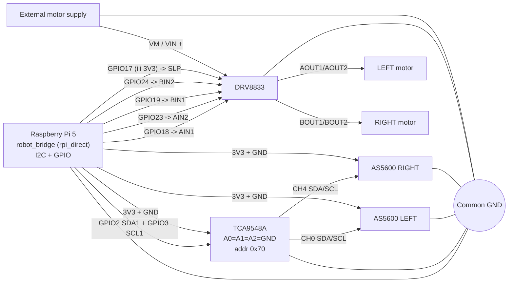

# Trenutna shema ozicenja (`rpi_direct`)

Ovo je trenutna aktivna arhitektura:

- `Raspberry Pi -> DRV8833 -> lijevi i desni motor`
- `Raspberry Pi -> TCA9548A -> AS5600 LEFT + AS5600 RIGHT` je oziceno,
  ali je u trenutnom stacku `ENCODERS_ENABLED=0`
- motori imaju vanjsko napajanje
- na nasem DRV8833 modulu `SLP` mora biti `HIGH` (inace su izlazi ugaseni)
- Nano ESP32 je `legacy` i nije potreban u normalnom radu

## Vizualizacija



## ASCII pregled

```text
Raspberry Pi 5
   |
   +-- I2C GPIO2/GPIO3 --> TCA9548A --> CH0 --> AS5600 LEFT
   |                                   \--> CH4 --> AS5600 RIGHT
   |
   +-- GPIO18 --> DRV8833 AIN1
   +-- GPIO23 --> DRV8833 AIN2
   +-- GPIO19 --> DRV8833 BIN1
   +-- GPIO24 --> DRV8833 BIN2
   +-- GPIO17 (ili 3V3) --> DRV8833 SLP
   |
   +-- 3V3/GND --> TCA9548A + AS5600

External motor supply --> DRV8833 VM/VIN

Sve mase moraju biti zajednicke:
RPi GND = TCA GND = AS5600 GND = DRV8833 GND = external supply GND
```

## Preporuceni pinout

### Raspberry Pi

- `pin 1 (3V3)` -> `TCA9548A VCC`
- `pin 6 (GND)` -> `TCA9548A GND`
- `pin 3 (GPIO2 / SDA1)` -> `TCA9548A SDA`
- `pin 5 (GPIO3 / SCL1)` -> `TCA9548A SCL`
- `pin 12 (GPIO18)` -> `DRV8833 AIN1`
- `pin 16 (GPIO23)` -> `DRV8833 AIN2`
- `pin 35 (GPIO19)` -> `DRV8833 BIN1`
- `pin 18 (GPIO24)` -> `DRV8833 BIN2`
- `pin 11 (GPIO17)` -> `DRV8833 SLP` (preporuceno za software kontrolu)

### TCA9548A

- `A0`, `A1`, `A2` -> `GND`
- `RESET` -> `3V3` (drzi HIGH)
- `CH0` -> lijevi `AS5600`
- `CH4` -> desni `AS5600`

### AS5600 LEFT / RIGHT

- `VCC` -> `RPi 3V3`
- `GND` -> zajednicka masa
- `SDA/SCL` -> preko `TCA9548A`

### DRV8833

- `AIN1` <- `RPi GPIO18`
- `AIN2` <- `RPi GPIO23`
- `BIN1` <- `RPi GPIO19`
- `BIN2` <- `RPi GPIO24`
- `AOUT1/AOUT2` -> lijevi motor
- `BOUT1/BOUT2` -> desni motor
- `VM` ili `VIN` -> vanjsko napajanje motora
- `GND` -> zajednicka masa
- `SLP` mora biti `HIGH` (na nasoj plocici bez toga nema napona na `AOUT/BOUT`)
- varijanta A (always-on): `SLP` direktno na `RPi 3V3`
- varijanta B (preporuceno): `SLP` na `RPi GPIO17` i `DRV_SLEEP_PIN=17`
- `nFAULT` nije potreban za osnovni rad

## Napajanje

- logika (`RPi`, `TCA9548A`, `AS5600`) radi na `3V3`
- `DRV8833 VM/VIN` i motori idu na vanjsko napajanje
- bez zajednicke mase sustav nece biti stabilan

## Software mapiranje

Za ovu shemu mora biti:

- `BRIDGE_MODE=rpi_direct`
- `BRIDGE_I2C_DEVICE=/dev/i2c-1`
- `BRIDGE_GPIOMEM_DEVICE=/dev/gpiochip4` (Pi 5)
- `DRV_SLEEP_PIN=17` ako je `SLP` spojen na GPIO17
- trenutni stack ima `ENCODERS_ENABLED=0`, pa bridge radi open-loop
  odometriju iz `/cmd_vel`, a `slam_cont` pokrece `rf2o_laser_odometry`
- za normalan rad s AS5600 enkoderima vrati `ENCODERS_ENABLED=1` u
  `bridge_rpi_direct.env` i uskladi odometrijski izvor u SLAM/EKF konfiguraciji

Ako je `SLP` spojen direktno na `3V3` (always-on):

- `DRV_SLEEP_PIN=-1`

Ako su enkoderi privremeno iskljuceni:

- `ENCODERS_ENABLED=0`
- `OPEN_LOOP_ODOM_FROM_CMD=1`

To ostavlja voznju aktivnom, ali odometrija postaje open-loop procjena.

## Legacy (Nano) napomena

Ako zelis vratiti stari nacin:

- `BRIDGE_MODE=serial_legacy`
- RPi <-> Nano USB serial
- Nano opet preuzima citanje enkodera i upravljanje motorima

Detalji su u:

- `HARDWARE_WIRING_GUIDE.md`
- `bridge_cont/README.md`
