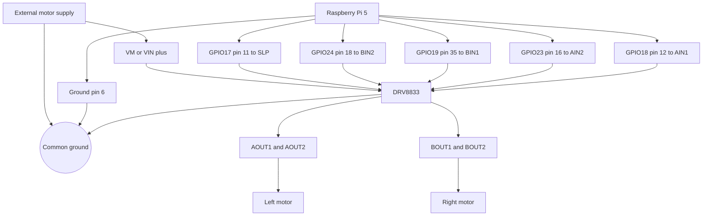

# Current Wiring (`rpi_direct`)

This document describes the deployed motor wiring.

```text
Raspberry Pi 5 -> GPIO -> DRV8833 -> left and right motors
```

The Raspberry Pi controls direction and speed through `libgpiod`. The motor supply is separate from the Raspberry Pi supply. Raspberry Pi ground, DRV8833 ground and motor-supply ground must be connected.

## Wiring diagram



## Raspberry Pi pins

| Signal | Physical pin | DRV8833 input | Function |
| --- | ---: | --- | --- |
| GPIO17 | 11 | `SLP` / `nSLEEP` | Driver enable |
| GPIO24 | 18 | `BIN2` | Right motor input 2 |
| GPIO19 | 35 | `BIN1` | Right motor input 1 |
| GPIO23 | 16 | `AIN2` | Left motor input 2 |
| GPIO18 | 12 | `AIN1` | Left motor input 1 |
| Ground | 6 | `GND` | Common ground |

## Motor outputs

| DRV8833 output | Connection |
| --- | --- |
| `AOUT1` / `AOUT2` | Left motor |
| `BOUT1` / `BOUT2` | Right motor |
| `VM` / `VIN+` | External motor supply |
| `GND` | Common ground |

## Active configuration

The deployed values are maintained in `robot-stack/config/containers/bridge_rpi_direct.env`:

```env
BRIDGE_MODE=rpi_direct
DRV_AIN1_PIN=18
DRV_AIN2_PIN=23
DRV_BIN1_PIN=19
DRV_BIN2_PIN=24
DRV_SLEEP_PIN=17
ENCODERS_ENABLED=0
RPI_LGPIO_CHIP=4
```

Always shut down the Raspberry Pi before disconnecting power:

```bash
sudo shutdown -h now
```
