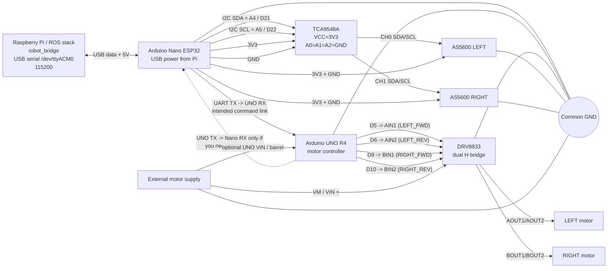

# Trenutna shema ožičenja

Ova shema je složena prema trenutnoj kombinaciji runtime stacka i firmwarea:

- `../stack/docker-compose.yaml`
- `devastator_sensors_nano_esp32/devastator_sensors_nano_esp32.ino`
- `devastator_controler_r4/devastator_controler_r4.ino`

Fokus je samo na granama koje si tražio:

- `Raspberry Pi -> Nano ESP32`
- `Nano ESP32 -> UNO R4`
- `UNO R4 -> DRV8833 -> motori`
- `Nano ESP32 -> TCA9548A -> enkoderi`

Napomena:

- `robot_bridge` u stacku razgovara USB-om samo s Nano ESP32.
- U trenutnom stacku je `RealSense` primarni izvor za `/imu/data`, a `/imu/arduino` je legacy/debug tema, pa IMU nije ucrtana u glavnu shemu.

## Čista vizualizacija



## ASCII pregled

```text
Raspberry Pi
   │
   └── USB ──> Nano ESP32
                 │
                 ├── I2C A4/A5 ──> TCA9548A ── CH0 ──> AS5600 LEFT
                 │                          └─ CH1 ──> AS5600 RIGHT
                 │
                 └── UART ──> UNO R4 ── D5 D6 D9 D10 ──> DRV8833 ──> LEFT / RIGHT motor

External motor supply ──> DRV8833 VM/VIN
External motor supply ──> UNO VIN/barrel (samo ako UNO napajaš s iste baterije)

Sve mase moraju biti zajedničke:
Pi USB GND = Nano GND = UNO GND = driver GND = encoder GND = external supply GND
```

## Pinovi koji su stvarno vidljivi u kodu

### Nano ESP32

- USB prema Raspberry Pi (`robot_bridge` na `/dev/ttyACM0`, `115200`)
- I2C default pinovi: `A4/SDA` i `A5/SCL`
- `TCA9548A` adresa: `0x70`
- `CH0` = lijevi enkoder
- `CH1` = desni enkoder
- TCA i AS5600 se hrane s `Nano 3V3`

### UNO R4

- `D5` -> `AIN1`
- `D6` -> `AIN2`
- `D9` -> `BIN1`
- `D10` -> `BIN2`

## Bitne napomene prije fizičkog spajanja

### 1. Buck converter

Buck ti stvarno nije potreban samo ako vrijedi ovo:

- Nano ESP32 dobiva napajanje preko USB-a s Raspberry Pi-a
- UNO R4 već ima svoje napajanje preko `VIN` / barrel jacka ili zasebnog USB-a

Ako UNO R4 nema drugi izvor napajanja, buck ne smiješ maknuti bez alternative.

### 2. DRV8833 sada direktno odgovara trenutnom UNO firmwareu

Aktualni `UNO R4` firmware koristi baš 4 upravljačka izlaza:

- `D5` -> `AIN1`
- `D6` -> `AIN2`
- `D9` -> `BIN1`
- `D10` -> `BIN2`

To je dobar match za `DRV8833`, jer ima 2 H-mosta:

- `AOUT1/AOUT2` -> lijevi motor
- `BOUT1/BOUT2` -> desni motor

Ako tvoja `DRV8833` breakout pločica ima dodatni pin `nSLEEP`, `SLP` ili `STBY`:

- ako je već pull-upan na modulu, može ostati nespojen
- ako nije, veži ga na `HIGH` da driver bude omogućen

`nFAULT` ti za osnovni rad ne treba spajati.

Vanjsko napajanje motora ide na `DRV8833 VM/VIN`, a mase moraju ostati zajedničke.

Naponski raspon za `DRV8833` je `2.7 V do 10.8 V`, pa je tipičan paket `6x NiMH` u redu dok si unutar tog raspona.

### 3. UART između Nano i UNO je trenutno najspornija točka

Arhitektura jasno kaže da `Nano -> UNO` ide preko UART-a, ali kod i dokumentacija nisu potpuno usklađeni:

- Nano firmware šalje komandne pakete preko `MotorSerial`
- UNO firmware čita komande preko `Serial`, a ne eksplicitno preko `Serial1`
- stariji dokumenti i komentari oko Nano UART pinova nisu sasvim konzistentni

Zato ovu shemu treba čitati kao "intended wiring", a UART pinove treba uskladiti s onim što ćeš stvarno ostaviti u firmwareu.

### 4. Trenutna razlika između starog crteža i stvarnog stacka

- `robot_bridge` je na Nano USB-u, ne na UNO-u
- enkoderi su u Nano kodu na `TCA CH0` i `TCA CH1`
- `/imu/arduino` je trenutno samo fallback/debug, nije glavni IMU za stack
