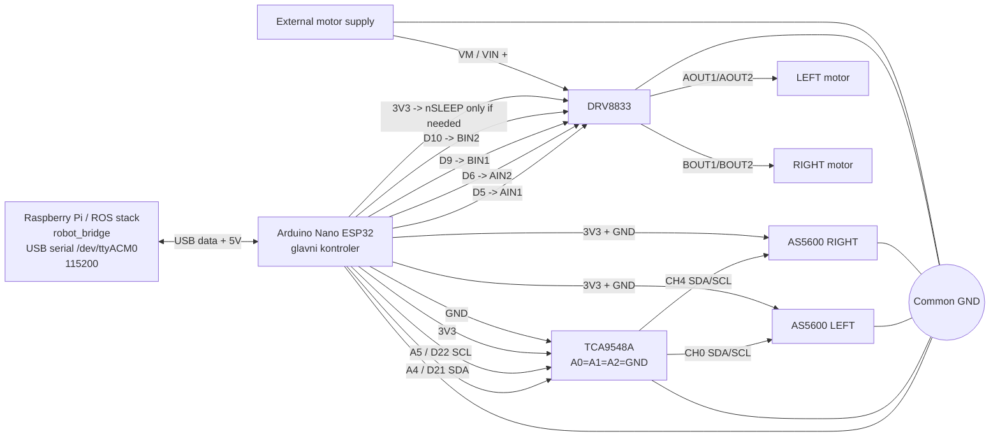

# Nano-only shema ozicenja

Ovo je odabrana pojednostavljena arhitektura:

- `Raspberry Pi / robot_bridge -> USB -> Arduino Nano ESP32`
- `Nano ESP32 -> DRV8833 -> lijevi i desni motor`
- `Nano ESP32 -> TCA9548A -> AS5600 LEFT + AS5600 RIGHT`

`UNO R4` vise nije potreban u ovoj varijanti.

## Vizualizacija



## ASCII pregled

```text
Raspberry Pi
   |
   +-- USB --> Nano ESP32
                  |
                  +-- I2C A4/A5 --> TCA9548A --> CH0 --> AS5600 LEFT
                  |                         \--> CH4 --> AS5600 RIGHT
                  |
                  +-- D5  --> DRV8833 AIN1
                  +-- D6  --> DRV8833 AIN2
                  +-- D9  --> DRV8833 BIN1
                  +-- D10 --> DRV8833 BIN2
                  |
                  +-- 3V3/GND --> senzori

External motor supply --> DRV8833 VM/VIN

Sve mase moraju biti zajednicke:
Pi USB GND = Nano GND = TCA GND = AS5600 GND = DRV8833 GND = external supply GND
```

## Preporuceni pinout

### Nano ESP32

- USB-C <-> Raspberry Pi
- `A4 / D21` -> `TCA9548A SDA`
- `A5 / D22` -> `TCA9548A SCL`
- `3V3` -> `TCA9548A VCC`
- `GND` -> `TCA9548A GND`
- `D5` -> `DRV8833 AIN1`
- `D6` -> `DRV8833 AIN2`
- `D9` -> `DRV8833 BIN1`
- `D10` -> `DRV8833 BIN2`

### TCA9548A

- `A0`, `A1`, `A2` -> `GND`
- `CH0` -> lijevi `AS5600`
- `CH4` -> desni `AS5600`

### AS5600 LEFT / RIGHT

- `VCC` -> `Nano 3V3`
- `GND` -> zajednicka masa
- `SDA/SCL` -> preko `TCA9548A`

### DRV8833

- `AIN1` <- `Nano D5`
- `AIN2` <- `Nano D6`
- `BIN1` <- `Nano D9`
- `BIN2` <- `Nano D10`
- `AOUT1/AOUT2` -> lijevi motor
- `BOUT1/BOUT2` -> desni motor
- `VM` ili `VIN` -> vanjsko napajanje motora
- `GND` -> zajednicka masa
- `nSLEEP` / `SLP`
  - ako je na modulu vec pull-upan, ostavi kako jest
  - ako nije, vezi na `HIGH` da driver bude aktivan
- `nFAULT` nije potreban za osnovni rad

## Napajanje

Buck converter ti nije potreban ako vrijedi ovo:

- Nano ESP32 dobiva napajanje preko USB-a s Raspberry Pi-a
- DRV8833 i motori dobivaju vanjsko napajanje
- sve mase su povezane zajedno

U ovoj varijanti nema vise zasebnog napajanja za `UNO`, jer `UNO` vise nije u sustavu.

## Sto se mijenja u firmwareu

U `Nano-only` varijanti Nano radi sve:

- prima `cmd_vel` preko USB protokola
- cita IMU
- cita oba `AS5600` enkodera
- racuna odometriju
- direktno upravlja `DRV8833`

Time se izbacuje:

- `Nano <-> UNO` UART veza
- `UNO R4` firmware iz glavnog toka rada
- dodatno olicenje i dodatna tocka kvara

## Stack utjecaj

Na Raspberry Pi strani skoro nista ne moras mijenjati:

- `robot_bridge` i dalje ide na Nano preko `/dev/ttyACM0`
- ROS topici ostaju isti
- mijenja se samo firmware i fizicko ozicenje na robotu
