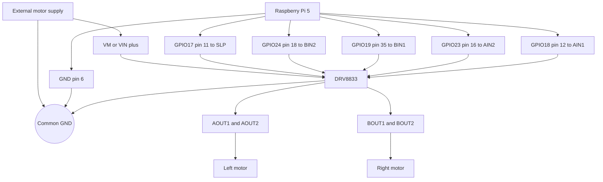

# Trenutna shema ožičenja (`rpi_direct`)

Ovaj dokument opisuje aktualno fizičko ožičenje robota u trenutnoj izvedbi diplomskog rada.

## Aktualna arhitektura ožičenja

```text
Raspberry Pi 5 -> GPIO -> DRV8833 -> lijevi i desni motor
```

Raspberry Pi 5 upravlja motorima preko GPIO pinova i `libgpiod` sučelja. DRV8833 upravlja smjerom i brzinom lijevog i desnog motora. Sustav koristi vanjsko napajanje motora i zajedničku masu između Raspberry Pi računala, DRV8833 modula i motornog napajanja.

## Vizualizacija



## Korišteni pinovi

| Raspberry Pi signal | Fizički pin | DRV8833 pin / funkcija | Uloga |
| --- | ---: | --- | --- |
| GPIO17 | 11 | `SLP` / `nSLEEP` | aktivacija DRV8833 modula |
| GPIO24 | 18 | `BIN2` | desni motor, ulaz 2 |
| GPIO19 | 35 | `BIN1` | desni motor, ulaz 1 |
| GPIO23 | 16 | `AIN2` | lijevi motor, ulaz 2 |
| GPIO18 | 12 | `AIN1` | lijevi motor, ulaz 1 |
| GND | npr. 6 | `GND` | zajednička masa |

## Povezivanje DRV8833 izlaza

| DRV8833 izlaz | Komponenta |
| --- | --- |
| `AOUT1` / `AOUT2` | lijevi motor |
| `BOUT1` / `BOUT2` | desni motor |
| `VM` / `VIN+` | vanjsko napajanje motora |
| `GND` | zajednička masa |

## Motor driver konfiguracija

```env
BRIDGE_MODE=rpi_direct
GPIOCHIP=/dev/gpiochip4
DRIVER=drv8833
ENCODERS_ENABLED=0
CMD_VEL_TOPIC=/cmd_vel
```

## Napajanje

- Raspberry Pi 5 dobiva stabilno USB-C napajanje ili kvalitetan powerbank s pouzdanim izlazom.
- Motori dobivaju odvojeno vanjsko napajanje prilagođeno motorima.
- Raspberry Pi GND, DRV8833 GND i masa motornog napajanja čine zajedničku masu sustava.
- Sigurno gašenje prije prekida napajanja:

```bash
sudo shutdown -h now
```

## Trenutno stanje fizičkog ožičenja

- Pogon motora: Raspberry Pi 5 GPIO -> DRV8833 -> motori.
- Način rada bridgea: `BRIDGE_MODE=rpi_direct`.
- Konfiguracija bridgea: `ENCODERS_ENABLED=0`.
- Izvor pozicije za navigaciju: LiDAR, SLAM, AMCL/Nav2 i dostupni ROS izvori poze.
- Zajednička masa povezuje Raspberry Pi, DRV8833 i vanjsko napajanje motora.

Arhitektura Jetson Orin anomaly pipelinea, `rosbridge` komunikacija i Foxglove vizualizacija opisani su u [ARCHITECTURE_OVERVIEW.md](./ARCHITECTURE_OVERVIEW.md).
