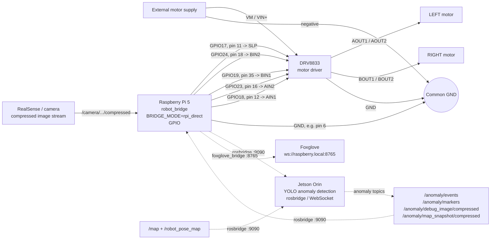

# Trenutna shema ozicenja (`rpi_direct`)

Ovaj dokument opisuje aktualno ozicenje robota u trenutnoj izvedbi diplomskog rada.

## Aktualna arhitektura

```text
Raspberry Pi 5 -> GPIO -> DRV8833 -> lijevi i desni motor
```

Raspberry Pi 5 upravlja motorima direktno preko GPIO pinova i `libgpiod` sucelja. DRV8833 preuzima upravljanje smjerom i brzinom motora. Motori imaju vanjsko napajanje, a Raspberry Pi, DRV8833 i motorno napajanje dijele zajednicku masu.

## Vizualizacija



## Koristeni pinovi

| Raspberry Pi signal | Fizicki pin | DRV8833 pin / funkcija | Uloga |
| --- | ---: | --- | --- |
| GPIO17 | 11 | `SLP` / `nSLEEP` | drzi DRV8833 aktivnim |
| GPIO24 | 18 | `BIN2` | smjer/PWM desnog motora, ulaz 2 |
| GPIO19 | 35 | `BIN1` | smjer/PWM desnog motora, ulaz 1 |
| GPIO23 | 16 | `AIN2` | smjer/PWM lijevog motora, ulaz 2 |
| GPIO18 | 12 | `AIN1` | smjer/PWM lijevog motora, ulaz 1 |
| GND | npr. 6 | `GND` | zajednicka masa |

## Motor driver

Aktivna implementacija koristi DRV8833 u `rpi_direct` nacinu rada.

Primjer konfiguracije:

```env
BRIDGE_MODE=rpi_direct
GPIOCHIP=/dev/gpiochip4
DRIVER=drv8833
ENCODERS_ENABLED=0
CMD_VEL_TOPIC=/cmd_vel
```

## Povezivanje DRV8833 izlaza

| DRV8833 izlaz | Komponenta |
| --- | --- |
| `AOUT1` / `AOUT2` | lijevi motor |
| `BOUT1` / `BOUT2` | desni motor |
| `VM` / `VIN+` | plus vanjskog napajanja motora |
| `GND` | zajednicka masa s Raspberry Pi-jem i motornim napajanjem |

## Napajanje

Za pouzdan rad bitno je:

- Raspberry Pi 5 dobiva stabilno USB-C napajanje ili kvalitetan powerbank s pouzdanim izlazom.
- Motori dobivaju odvojeno vanjsko napajanje prilagodjeno motorima.
- Raspberry Pi GND, DRV8833 GND i minus motornog napajanja spojeni su u zajednicku masu.
- Prije fizickog prekida napajanja koristi se sigurno gasenje sustava:

```bash
sudo shutdown -h now
```

## Trenutno stanje sustava

- Pogon motora: Raspberry Pi 5 GPIO -> DRV8833 -> motori.
- Nacin rada bridgea: `BRIDGE_MODE=rpi_direct`.
- Izvor pozicije za navigaciju: LiDAR, SLAM, AMCL/Nav2 i dostupni ROS izvori poze.
- Detekcija anomalija: Jetson Orin + YOLO preko `rosbridge` WebSocketa.
- Prvi scenarij anomalije: `bottle` / boca.
- Spremanje anomaly artefakata: Jetson lokalno sprema originalnu sliku, anotiranu sliku, sliku mape i JSONL event log.
- Vizualizacija: Foxglove se spaja na Raspberry Pi `foxglove_bridge` i prikazuje robot, mapu i anomaly topice.
